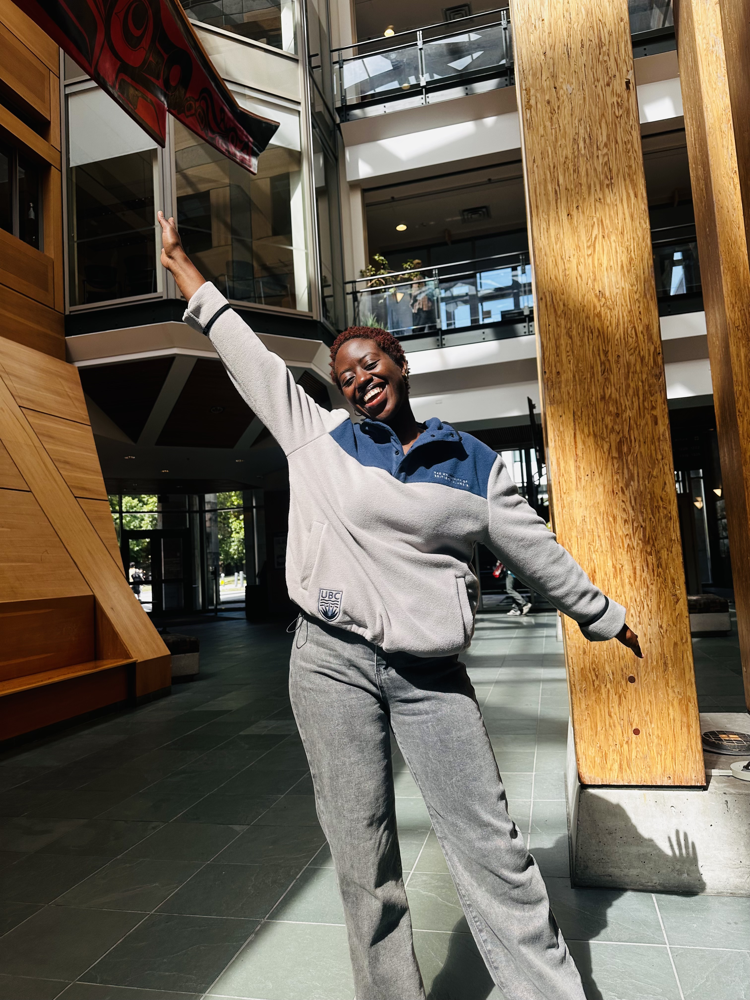

{.first-day}

My first week in the MDS program felt like the beginning of a very exciting chapter, but by the end of the week, I found myself feeling a little uncertain about what lay ahead. After studying Computer Science and working as a software engineer, I came into the program feeling confident about my technical background, but I quickly realized that data science would push me to think differently. Moving from Rwanda and starting school in a completely new environment has also made the experience more meaningful. There have been moments of excitement, moments of feeling overwhelmed, and a lot of moments where I’ve reminded myself why I chose to take this step.

One of my favorite parts of the first week has been meeting my classmates and hearing about their different backgrounds and experiences. I now have friends from China, India, Mexico,and Canada, having different skills across different sectors. Being surrounded by people who have different strengths has made me feel both challenged and motivated. Coming from a software engineering background, I’m used to thinking about how to build things, but I’m excited to learn how to ask better questions of data and use it to understand problems more deeply. My biggest suprise this week however, was the realization that this program is indeed intensive. There are lots of challenging assignments to keep up with. 

All in all, I think the biggest feeling I’m taking away is hopeful anticipation. I know the next few months will be demanding, and there will probably be many moments when I question whether I can keep up. But I also know that growth usually comes from being uncomfortable and trying something new. Having gotten a better sense of how the program is structured, I now feel more mentally prepared for the effort required in the coming weeks. I have a clearer idea of how to manage my time and make good use of the resources available to me while maintaining a healthy balance and avoiding burnout and feeling overwhelmed.